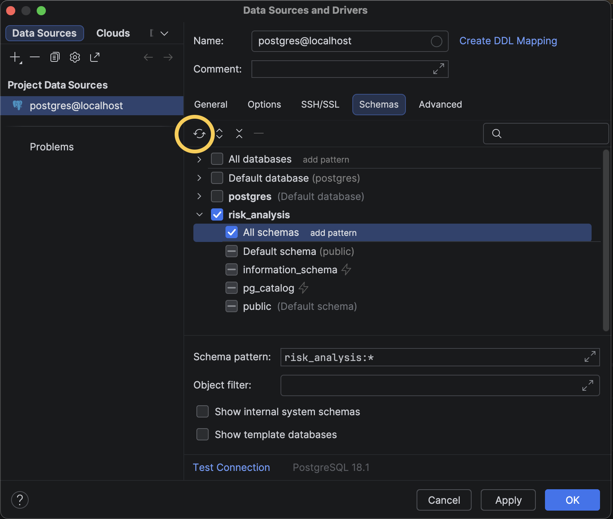
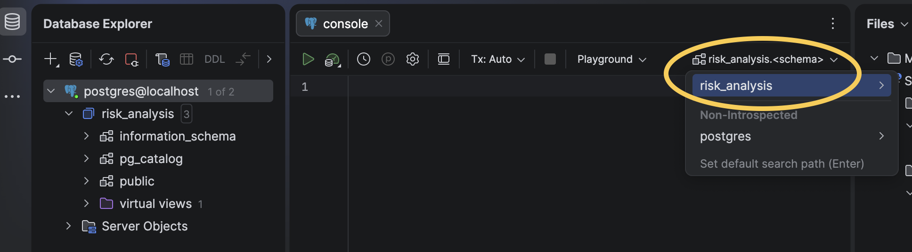
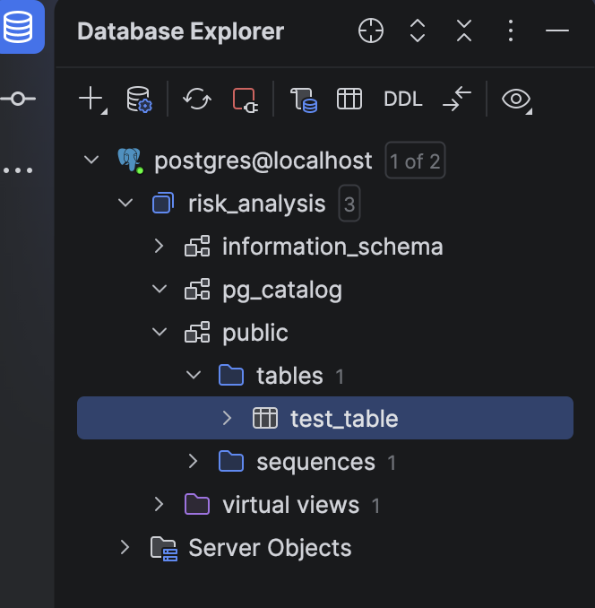
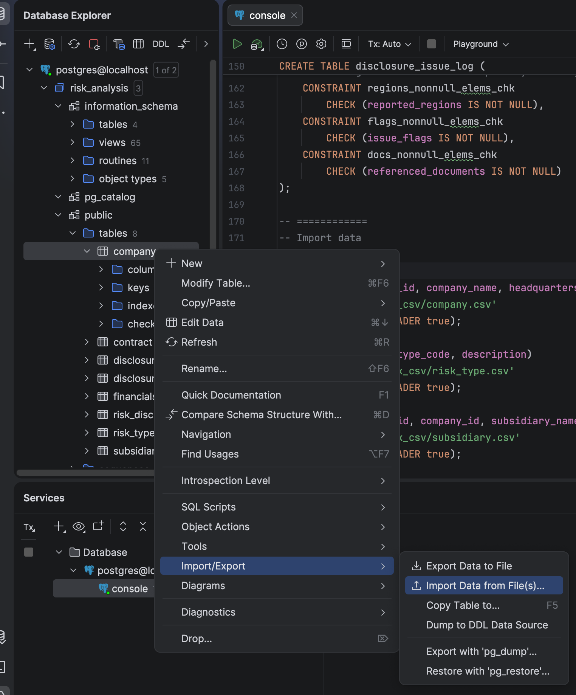
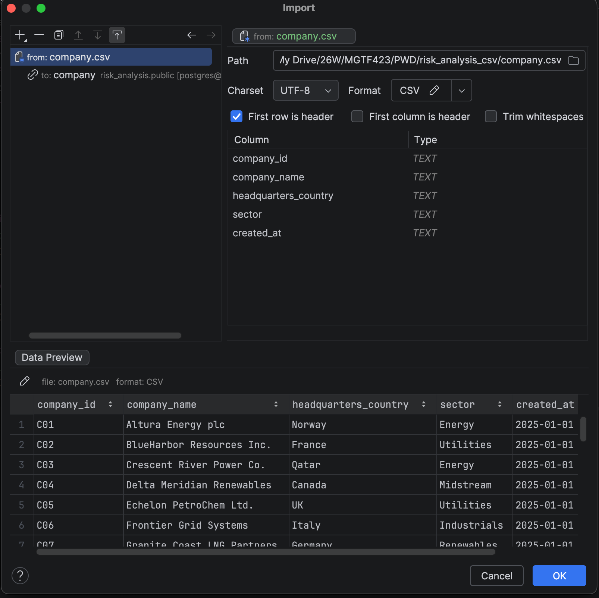
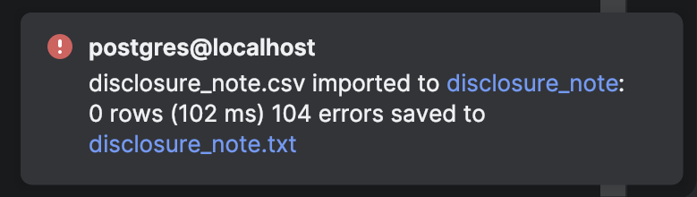
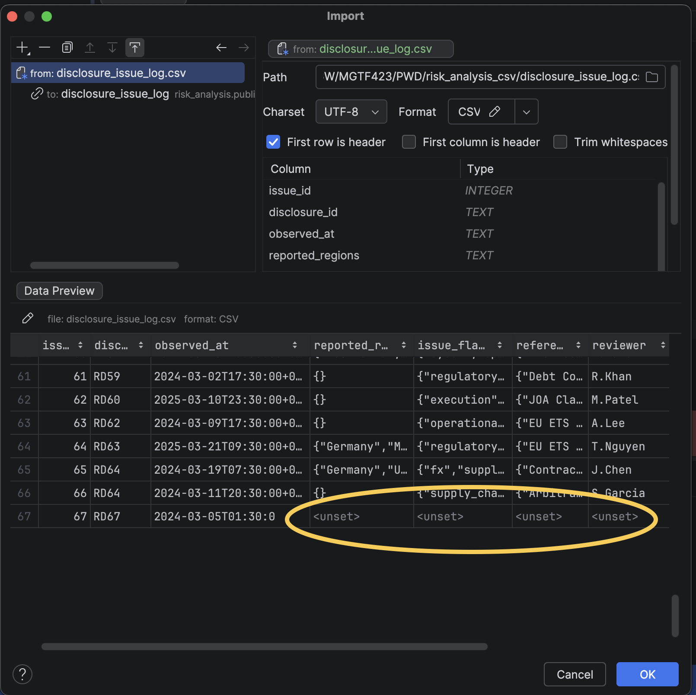

# Creating risk analysis database using DataGrip
by Ivana Mao
## 1. Install DataGrip and setting up the working directory
- Please refer to the video under Canvas Week 2 model ["PostgreSQL and Datagrip Tutorial"](https://drive.google.com/file/d/1fbGFU1rLUIYQvoJ52juleMtw5UwM_k3a/view?usp=sharing) starting from 3:12

## 2. Find risk_analysis database created from Jupyter [last week](https://github.com/ivanamao/MGTF423/blob/5adb9be87b3ea054eaa40d19eaf771f647b2a5d8/PostgreSQL%20and%20Jupyter%20Setup.md)
- In Database Explorer, right click on postgres@localhost, select Properties
- Go to Schemas tab, press Refresh, risk_analysis database should appear, select risk_analysis and All schemas under it, unselect others

- Switch current schema to risk_analysis

- You should be able to see the test_table we created last week from the Database Explorer window


## 3. Check and drop the test_table
- Enter the following in DataGrip console then run:
```sql
SELECT * FROM test_table; 
-- You should see the test_table show up in the Services window.

DROP TABLE test_table;
-- test_table is gone from Database Explorer window -> risk_analysis -> public -> tables
```

## 4. Create tables
```sql
-- From week 2 lecture notes
------------------------------
-- 1) Company (parent entity)
------------------------------
CREATE TABLE company (
    company_id CHAR(3) PRIMARY KEY, --e.g., 'C01'
    company_name VARCHAR(200) NOT NULL,
    headquarters_country VARCHAR(80) NOT NULL,
    sector VARCHAR(80) NOT NULL, --e.g., 'Energy', 'Utilities'
    created_at TIMESTAMPTZ NOT NULL DEFAULT NOW(),
    CONSTRAINT company_id_format_chk
        CHECK(company_id~'^C[0-9]{2}$')
);

----------------------------------
-- 2) Subsidiary (owned by company)
----------------------------------
CREATE TABLE subsidiary (
    sub_id CHAR(3) PRIMARY KEY, --e.g., 'S01'
    company_id CHAR(3) NOT NULL REFERENCES company(company_id)
        ON UPDATE CASCADE ON DELETE RESTRICT,
    subsidiary_name VARCHAR(200) NOT NULL,
    country VARCHAR(80) NOT NULL,
    address TEXT NOT NULL,
    ownership_pct NUMERIC(5,2) NOT NULL, --0.00 to 100.00
    created_at TIMESTAMPTZ NOT NULL DEFAULT NOW(),
    CONSTRAINT sub_id_format_chk
        CHECK (sub_id ~ '^S[0-9]{2}$'),
    CONSTRAINT ownership_pct_chk
        CHECK(ownership_pct>= 0 AND ownership_pct<= 100)
);

----------------------------------
-- 3) Financials (annual company data)
----------------------------------
CREATE TABLE financials (
    company_id CHAR(3) NOT NULL
        REFERENCES company(company_id)
        ON UPDATE CASCADE ON DELETE RESTRICT,
    year INT NOT NULL,
    revenue NUMERIC(14,4) NOT NULL,
    revenue_unit VARCHAR(20) NOT NULL,
    capex NUMERIC(14,4) NOT NULL,
    capex_unit VARCHAR(20) NOT NULL,
    debt NUMERIC(14,4) NOT NULL,
    debt_unit VARCHAR(20) NOT NULL,
    reported_at TIMESTAMPTZ NOT NULL DEFAULT NOW(),
    CONSTRAINT financials_pk
        PRIMARY KEY (company_id, year),
    CONSTRAINT financials_year_chk
        CHECK (year BETWEEN 1990 AND 2100),
    CONSTRAINT financials_units_chk
        CHECK (
            revenue_unit IN('USD', 'USD_MILLIONS', 'USD_BILLIONS')
            AND capex_unit IN ('USD', 'USD_MILLIONS', 'USD_BILLIONS')
            AND debt_unit IN ('USD', 'USD_MILLIONS', 'USD_BILLIONS')
        ),
    CONSTRAINT financials_nonneg_chk
        CHECK (revenue >= 0 AND capex >= 0 AND debt >= 0)
);

----------------------------------
-- 4) Contract
----------------------------------
CREATE TABLE contract (
    contract_id CHAR(3) PRIMARY KEY, --e.g., 'K01'
    sub_id CHAR(3) NOT NULL REFERENCES subsidiary(sub_id)
        ON UPDATE CASCADE ON DELETE RESTRICT,
    counterparty VARCHAR(200) NOT NULL,
    start_date DATE NOT NULL,
    end_date DATE, --NULL allowed for open-ended/pending
    status VARCHAR(12) NOT NULL, --'PAST'|'CURRENT'|'PENDING'
    signed_at TIMESTAMPTZ, --optional
    created_at TIMESTAMPTZ NOT NULL DEFAULT NOW(),
    CONSTRAINT contract_id_format_chk
        CHECK (contract_id~ '^K[0-9]{2}$'),
    CONSTRAINT contract_status_chk
        CHECK (status IN ('PAST','CURRENT','PENDING')),
    CONSTRAINT contract_date_chk
        CHECK (end_date IS NULL OR end_date>= start_date)
);

-- --------------------------------
-- RiskType (lookup / constraint)
-- Run this before 5) RiskDisclosure
-- --------------------------------
CREATE TABLE risk_type (
    risk_type_code VARCHAR(40) PRIMARY KEY, -- e.g., 'Geopolitical'
    description TEXT,
    created_at TIMESTAMPTZ NOT NULL DEFAULT NOW()
);

---------------------------------------------
-- 5) RiskDisclosure (declared risk "claim")
---------------------------------------------
CREATE TABLE risk_disclosure (
    disclosure_id CHAR(4) PRIMARY KEY, --e.g., 'RD01'
    company_id CHAR(3) NOT NULL REFERENCES company(company_id)
        ON UPDATE CASCADE ON DELETE RESTRICT,
    year INT NOT NULL,
    risk_type VARCHAR(40) NOT NULL REFERENCES risk_type(risk_type_code)
        ON UPDATE CASCADE ON DELETE RESTRICT,
    summary_text TEXT NOT NULL,
    filed_at TIMESTAMPTZ, --optional: when filed/entered
    created_at TIMESTAMPTZ NOT NULL DEFAULT NOW(),
    CONSTRAINT disclosure_id_format_chk
        CHECK (disclosure_id~ '^RD[0-9]{2}$'),
    CONSTRAINT year_reasonable_chk
        CHECK (year BETWEEN 1990 AND 2100),
    CONSTRAINT risk_disclosure_uniq
        UNIQUE (company_id, year, risk_type)
);


-- ------------------------------------------------------
-- 6) DisclosureNote (supporting narrative; many per risk)
-- PK–FK design: many notes per risk_disclosure
-- ------------------------------------------------------
CREATE TABLE disclosure_note (
    note_id CHAR(4) PRIMARY KEY, -- e.g., 'DN01'
    disclosure_id CHAR(4) NOT NULL REFERENCES risk_disclosure(disclosure_id)
        ON UPDATE CASCADE ON DELETE CASCADE,
    risk_subtype VARCHAR(80) NOT NULL, -- e.g., 'Sovereign Stability'
    note_text TEXT NOT NULL,
    authored_at TIMESTAMPTZ, -- optional
    created_at TIMESTAMPTZ NOT NULL DEFAULT NOW(),
    CONSTRAINT note_id_format_chk
        CHECK (note_id ~ '^DN[0-9]{2}$')
);

-- -------------------------------------------------------------------
-- 7) DisclosureIssueLog (observational; array-valued columns)
-- -------------------------------------------------------------------
CREATE TABLE disclosure_issue_log (
    issue_id BIGSERIAL PRIMARY KEY,
    disclosure_id CHAR(4) NOT NULL REFERENCES risk_disclosure(disclosure_id)
        ON UPDATE CASCADE ON DELETE CASCADE,
    observed_at TIMESTAMPTZ NOT NULL DEFAULT NOW(),
        -- Observational arrays (entered by analysts/reviewers)
    reported_regions TEXT[] NOT NULL DEFAULT ARRAY[]::TEXT[],
    issue_flags TEXT[] NOT NULL DEFAULT ARRAY[]::TEXT[],
    referenced_documents VARCHAR(64)[] NOT NULL DEFAULT ARRAY[]::VARCHAR(64)[],
    reviewer VARCHAR(120), -- optional
    notes TEXT, -- optional free-form
        -- Light constraints to keep arrays meaningful
    CONSTRAINT regions_nonnull_elems_chk
        CHECK (reported_regions IS NOT NULL),
    CONSTRAINT flags_nonnull_elems_chk
        CHECK (issue_flags IS NOT NULL),
    CONSTRAINT docs_nonnull_elems_chk
        CHECK (referenced_documents IS NOT NULL)
);
```
- As you run these commands, you should find new tables popping up in Database Explore -> risk_analysis -> public -> tables 

## 5. Import data
Download the following csv files under Canvas Week 2 module, save them to a local folder:
  1. company.csv
  2. subsidiary.csv
  3. financials.csv 
  4. contract.csv 
  5. risk_type.csv 
  6. risk_disclosure.csv 
  7. disclosure_note.csv 
  8. disclosure_issue_log.csv
### 5.1 Import data using DataGrip
- Right click on "company" table in Database Explore window -> Import/Export -> Import Data from File(s):

- Select company.csv you just downloaded
- In the import window, select "from: company.csv", tick "First row is header“ option, then press OK:

- Repeat these steps for the rest of the tables. They need to be done in the order as above from 1. to 8. because there are dependencies between the tables
- When importing csv for table disclosure_note, you should see an error that prevent you from doing so:

- Clicking into the disclosure_note.txt file it created, it says that the check constraint note_id_format_chk is 
  violated:
`CONSTRAINT note_id_format_chk CHECK (note_id ~ '^DN[0-9]{2}$')`. Indeed, the note_id variable in the csv file is integer, does not satisfy the check condition.
- We can work our way around this by creating a staging table:
```sql
-- Staging table for disclosure_note
CREATE TABLE disclosure_note_stage (
    note_id_raw TEXT,
    disclosure_id TEXT,
    risk_subtype TEXT,
    note_text TEXT,
    authored_at TIMESTAMPTZ,
    created_at TIMESTAMPTZ
);

-- Now, import the disclosure_note.csv to this staging table, it should work fine

-- then transform the staging table into the table we want:
INSERT INTO disclosure_note (
    note_id, disclosure_id, risk_subtype, note_text, authored_at, created_at
)
SELECT
    'DN' || LPAD(note_id_raw::text, 2, '0') AS note_id,
    disclosure_id,
    risk_subtype,
    note_text,
    authored_at,
    created_at
FROM disclosure_note_stage
WHERE note_id_raw::int < 100; -- The raw data has 3-digit note_id, we need to remove them

DROP TABLE disclosure_note_stage;
```
### 5.2 Import data using Terminal
- Sometimes importing from DataGrip GUI may not be reliable. In the screenshot below, the csv was not well parsed 
  when importing disclosure_issue_log.csv, and we lose all the data after row 67:

- Importing data from Terminal is more reliable. Do the following in Terminal (you can do it in the embedded 
  terminal in DataGrip):
```bash
psql -U postgres  
## then enter password

\c risk_analysis  
## connect to risk_analysis database

\copy disclosure_issue_log FROM '<your local path to disclosure_issue_log.csv>' WITH (FORMAT csv, HEADER true, QUOTE 
'"', ESCAPE '"');
## now the disclosure_issue_log table is populated
```
## 6. Explore
- Now all the tables are populated, let's try these queries from lecture notes
```sql
-- The Find All Query
SELECT * FROM risk_disclosure;

-- The Basic Syntax
SELECT disclosure_id, company_id, risk_type, year
  FROM risk_disclosure
  WHERE risk_type = 'Climate'
      AND summary_text IS NOT NULL
      AND year >= 2023;

-- Substrings
SELECT substring(note_text FROM 1 FOR 40)
FROM disclosure_note;

SELECT substring(note_text FROM 1 FOR 25)
FROM disclosure_note
WHERE substring(note_text FROM 1 FOR 11) = 'The company';

-- String Functions
SELECT left(split_part(note_text, 'Operations and counterparties spanning ', 2),30)
FROM disclosure_note
WHERE split_part(note_text, 'Operations and counterparties spanning ', 2) <> '';

SELECT note_text
FROM disclosure_note
WHERE length(note_text) < 400;

SELECT
    upper(rd.risk_type)
    || ' :: '
    || lower(dn.risk_subtype)
AS risk_type_subtype
FROM risk_disclosure rd
JOIN disclosure_note dn
ON rd.disclosure_id = dn.disclosure_id;

-- The LIKE operator
SELECT note_id, disclosure_id
FROM disclosure_note
WHERE note_text LIKE '%policy%';

SELECT note_id
FROM disclosure_note
WHERE LOWER(note_text) LIKE '%regulator%';

SELECT note_id
FROM disclosure_note
WHERE note_text LIKE 'The company%';

SELECT note_id, note_text
FROM disclosure_note
WHERE LOWER(note_text) LIKE '%price%hedg%';

SELECT note_id, risk_subtype, note_text
FROM disclosure_note
WHERE note_text LIKE '%202_%';

SELECT note_id, risk_subtype, note_text
FROM disclosure_note
WHERE LENGTH(note_text) < 500
AND note_text LIKE '%Nigeria%';
```
